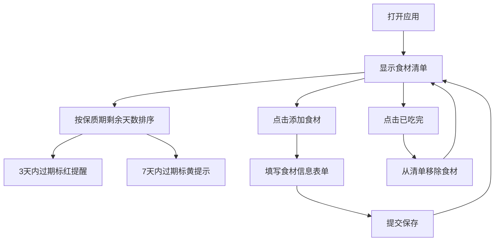

## 1. 产品概述

冰箱食材管理工具是一款帮助用户管理家中冰箱食材、追踪保质期、减少食物浪费的前端应用。用户可以录入购买的食材信息，系统自动按保质期剩余天数排序并提供过期提醒。

- 目标用户：家庭主妇、独居青年、注重食材新鲜度的人群
- 核心价值：帮助用户及时了解食材新鲜度，减少食物浪费，提升生活品质

## 2. 核心功能

### 2.1 用户角色

| 角色 | 注册方式 | 核心权限 |
|------|----------|----------|
| 普通用户 | 无需注册，本地存储 | 食材增删改查、过期提醒、已吃完标记 |

### 2.2 功能模块

1. **食材清单页**：食材列表展示、按保质期排序、过期状态标识、删除操作
2. **添加食材**：表单录入食材信息（名称、数量、购买日期、保质期、存放位置）
3. **过期提醒**：3天内过期标红推送提醒，7天内过期标黄提示
4. **已吃完标记**：点击"已吃完"按钮从清单中移除食材

### 2.3 页面详情

| 页面名称 | 模块名称 | 功能描述 |
|---------|----------|----------|
| 食材清单页 | 顶部统计栏 | 显示食材总数、即将过期数量、已过期数量 |
| 食材清单页 | 食材列表 | 卡片式展示食材信息，按保质期剩余天数升序排列 |
| 食材清单页 | 筛选标签 | 按存放位置筛选（全部/冷藏/冷冻/常温） |
| 添加食材 | 表单弹窗 | 录入食材名称、数量、购买日期、保质期天数、存放位置 |
| 食材卡片 | 状态标识 | 3天内过期红色边框+提醒角标，7天内过期黄色边框 |
| 食材卡片 | 操作按钮 | "已吃完"按钮点击后移除食材 |

## 3. 核心流程

用户打开应用 → 查看食材清单（按保质期排序）→ 点击"添加食材"按钮 → 填写食材信息表单 → 提交后食材加入清单 → 系统自动计算剩余天数并排序 → 3天内过期食材标红显示 → 用户点击"已吃完"按钮 → 食材从清单移除

## 4. 用户界面设计

### 4.1 设计风格

- 主色调：清新薄荷绿（代表新鲜、健康）
- 辅助色：暖橙（提醒）、红色（过期警告）、黄色（即将过期）
- 卡片风格：圆角卡片，柔和阴影，悬浮微动效
- 字体：圆润现代无衬线字体，清晰易读
- 图标：使用 Lucide 图标，简洁线性风格
- 整体风格：清新、温暖、生活化，营造温馨的厨房氛围

### 4.2 页面设计概览

| 页面名称 | 模块名称 | UI 元素 |
|---------|----------|---------|
| 食材清单页 | 顶部标题区 | 大标题"我的冰箱"，副标题显示食材总数 |
| 食材清单页 | 统计卡片 | 三色统计块（正常/即将过期/已过期） |
| 食材清单页 | 筛选标签栏 | 横向滚动标签，选中态高亮 |
| 食材清单页 | 食材列表 | 垂直卡片列表，带进入动画 |
| 添加食材 | 浮动按钮 | 右下角圆形+号按钮，点击展开表单 |
| 添加食材 | 表单弹窗 | 半透明遮罩+居中卡片，滑入动画 |
| 食材卡片 | 状态指示 | 左侧彩色竖条标识过期状态 |
| 食材卡片 | 食材信息 | 名称、数量、购买日期、剩余天数 |

### 4.3 响应式设计

- 桌面端：最大宽度 768px 居中显示，卡片两列布局
- 移动端：单列卡片布局，按钮触控区域放大
- 触控优化：所有可点击元素最小尺寸 44px

### 4.4 交互动效

- 页面加载：食材卡片依次淡入上移
- 悬浮效果：卡片悬浮时轻微上浮+阴影加深
- 添加动画：新食材从底部滑入
- 删除动画：食材卡片缩小淡出
- 按钮反馈：点击时有缩放效果
