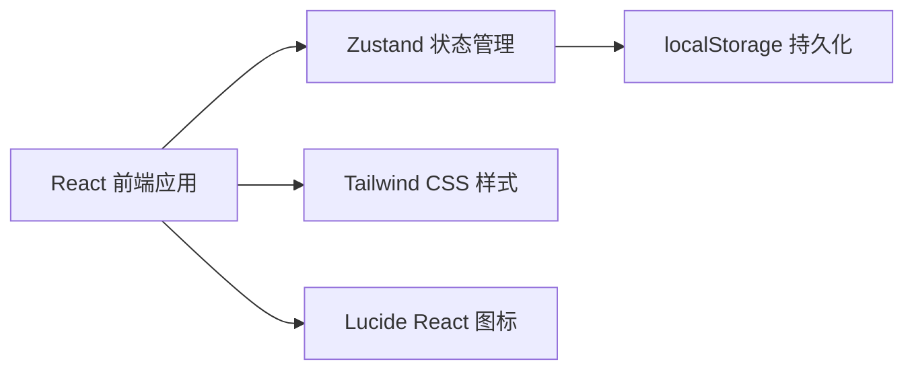
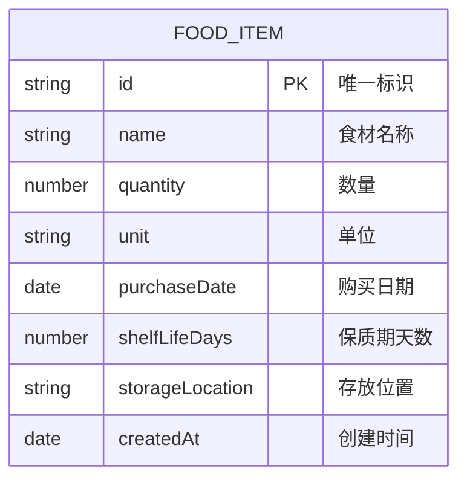

## 1. 架构设计



纯前端应用，数据存储在浏览器 localStorage 中，无需后端服务。

## 2. 技术说明

- 前端框架：React 18 + TypeScript
- 构建工具：Vite
- 样式方案：Tailwind CSS 3
- 状态管理：Zustand
- 图标库：Lucide React
- 数据存储：localStorage（本地持久化）
- 初始化工具：vite-init

## 3. 路由定义

| 路由 | 页面 | 用途 |
|------|------|------|
| / | 食材清单页 | 展示食材列表、统计信息、筛选功能 |

单页应用，使用弹窗形式展示添加食材表单。

## 4. 数据模型

### 4.1 数据模型定义



### 4.2 TypeScript 类型定义

```typescript
type StorageLocation = 'refrigerator' | 'freezer' | 'room';

interface FoodItem {
  id: string;
  name: string;
  quantity: number;
  unit: string;
  purchaseDate: string;
  shelfLifeDays: number;
  storageLocation: StorageLocation;
  createdAt: string;
}

type ExpiryStatus = 'normal' | 'warning' | 'danger' | 'expired';
```

### 4.3 状态管理 Store

```typescript
interface FoodStore {
  items: FoodItem[];
  filter: StorageLocation | 'all';
  addItem: (item: Omit<FoodItem, 'id' | 'createdAt'>) => void;
  removeItem: (id: string) => void;
  setFilter: (filter: StorageLocation | 'all') => void;
  getSortedItems: () => FoodItem[];
  getExpiryStatus: (item: FoodItem) => ExpiryStatus;
  getDaysRemaining: (item: FoodItem) => number;
}
```

## 5. 项目结构

```
src/
├── components/
│   ├── FoodCard.tsx        # 食材卡片组件
│   ├── AddFoodModal.tsx    # 添加食材弹窗
│   ├── FilterTabs.tsx      # 筛选标签栏
│   ├── StatsBar.tsx        # 统计栏
│   └── FloatingButton.tsx  # 浮动添加按钮
├── store/
│   └── useFoodStore.ts     # Zustand 状态管理
├── utils/
│   └── dateUtils.ts        # 日期工具函数
├── types/
│   └── index.ts            # 类型定义
├── pages/
│   └── Home.tsx            # 主页
├── App.tsx
├── main.tsx
└── index.css
```

## 6. 核心功能实现说明

### 6.1 保质期计算
- 购买日期 + 保质期天数 = 过期日期
- 过期日期 - 当前日期 = 剩余天数
- 剩余天数 <= 0：已过期（红色）
- 剩余天数 <= 3：即将过期（红色提醒）
- 剩余天数 <= 7：注意食用（黄色提示）
- 剩余天数 > 7：正常（绿色）

### 6.2 排序规则
- 默认按剩余天数升序排列（快过期的排前面）
- 相同剩余天数按创建时间排序

### 6.3 数据持久化
- 使用 Zustand persist 中间件
- 存储键名：`fridge-food-items`
- 页面刷新后数据不丢失

### 6.4 提醒机制
- 页面加载时检查是否有3天内过期食材
- 如有则顶部显示提醒横幅
- 使用浏览器 Notification API（可选）
